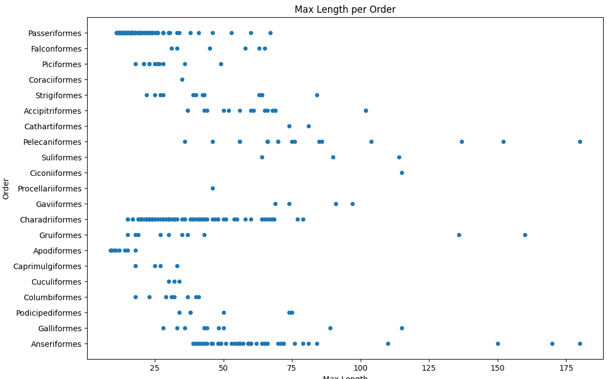
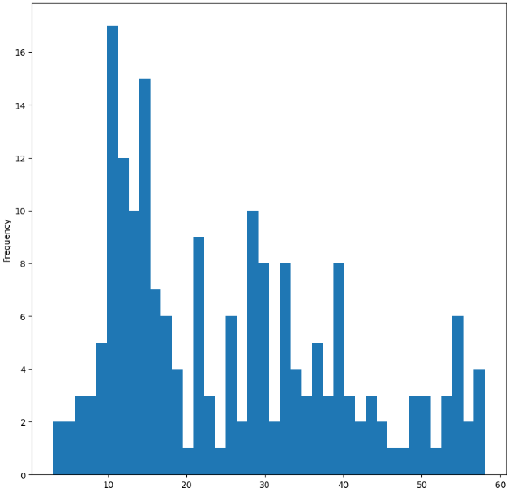
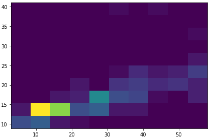
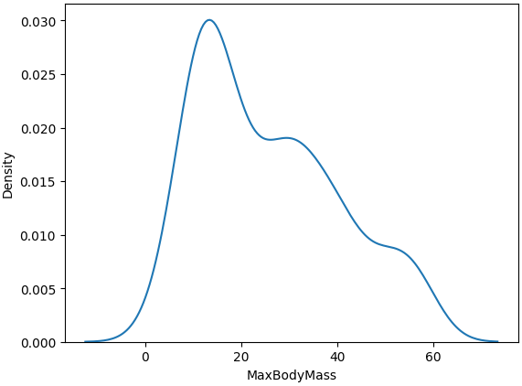

# Quantities
## Matplotlib
matplotlib cung cấp nhiều phương pháp hiển thị các hình ảnh trực quan:
bao gồm line charts, scatterplots, and bar plot ...

Cần dùng các biểu đồ tương ứng với mục đích và loại dữ liệu:
- phân tích xu hướng: line
- so sánh:  bar, column, pie, scatterplot
- một phần tổng thể: pie
- phân phối dữ liệu: scatterplot, bar
- mối quan hệ giữa các giá trị:  line, scatterplot, bubble

# Distributions

Có các phương pháp khác nhau để hiển thị distribution:
+ Scatter plot
\
--> Tuy nhiên phương pháp này không phải tối ưu để hiển thị một phân phối 
+ Histogram:
Đây là một loại biểu đồ có trục x là khoảng giá trị được chia bởi  các bins và trục y là các frequence (số lần các bản ghi nằm trong bin đó)
\
--> số lượng bin càng lớn thì biểu đồ sẽ càng mịn\
--> biều đồ này có thể chọn dữ liệu hiển thị trong một phạm vi nhất định

+  2D histogram: \
\
--> Đây là công cụ trực quan hóa dữ liệu dùng để hiển thị phân bố của hai biến số liên tục trong không gian hai chiều. Nó chia không gian 2D thành các ô (bin) và đếm số lượng điểm dữ liệu rơi vào mỗi ô đó.\
--> đây là dạng biểu đồ thể hiện mối quan hệ giữa hai phân bố

+ Density plots:
Để hiển thị các biểu đồ mượt hơn và liên tục hơn ta sử dụng biểu đồ density plots\
\

Hàm sns.kdeplot() trong thư viện Seaborn được sử dụng để vẽ đồ thị hàm mật độ kernel (KDE). Dưới đây là một số tham số phổ biến có thể sử dụng:

* data: Dữ liệu đầu vào, có thể là một mảng NumPy, Series của Pandas hoặc DataFrame. Đây là dữ liệu muốn ước lượng mật độ.

* x: Tên cột (hoặc dữ liệu) trong data mà ta muốn vẽ. Tham số này là cần thiết nếu ta đang sử dụng DataFrame.

* bw_adjust: Điều chỉnh độ rộng băng thông. Như đã đề cập, giá trị này ảnh hưởng đến độ mượt mà của đồ thị.

* kernel: Loại kernel được sử dụng cho ước lượng mật độ. Các lựa chọn bao gồm 'gau' (Gaussian), 'tri' (triangular), 'cos', v.v.

* fill: Nếu True, vùng dưới đồ thị sẽ được tô màu.

* cumulative: Nếu True, vẽ hàm mật độ tích lũy thay vì hàm mật độ chuẩn.

* color: Màu sắc của đường vẽ. ta có thể chỉ định màu bằng tên màu hoặc mã hex.

* alpha: Độ trong suốt của đường vẽ (giá trị từ 0 đến 1).

* linestyle: Kiểu đường vẽ (ví dụ: '-', '--', ':', v.v.).

* linewidth: Độ dày của đường vẽ.

* ax: Đối tượng Axes mà ta muốn vẽ vào. Nếu không được chỉ định, Seaborn sẽ tạo một Axes mới.

* legend: Nếu True, thêm chú thích cho đồ thị.

* hue :Tham số này dùng để phân loại dữ liệu theo biến . Mỗi giá trị khác nhau sẽ có màu sắc khác nhau trong biểu đồ, giúp dễ dàng so sánh giữa các nhóm.

* common_norm = False: Điều này có nghĩa là mỗi nhóm (theo biến hue) sẽ được chuẩn hóa riêng. Nếu là True, tất cả các nhóm sẽ được chuẩn hóa về tổng mật độ chung.

... 