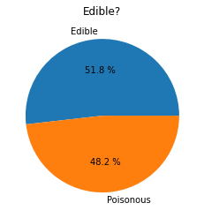
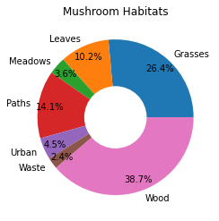
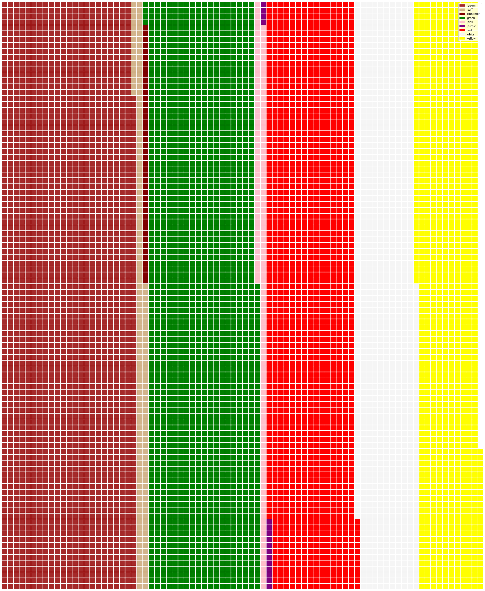
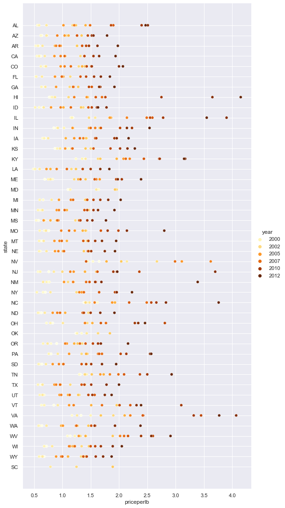
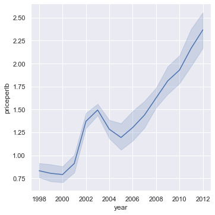
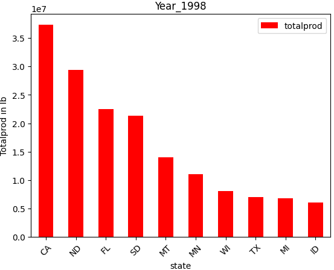
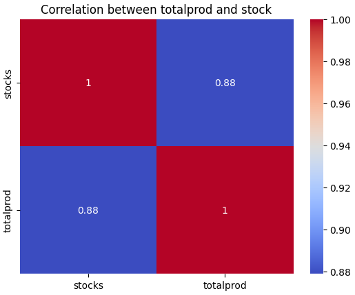

# Visualizing proportions
Dữ liệu: phần trăm, một phần trong tổng thể, cơ cấu, tỷ lệ, ....\
-> thể hiện cơ cấu, tỷ lệ trong tổng thể, mức độ quan trọng, thay đổi cơ cấu theo thời gian, ...

Có nhiều loại biểu đồ để có thể hiển thị được những thông tin này

+ Biểu đồ trong (pie)\

+ Biểu đồ bánh rán(donut)\

+ Biểu đồ bánh quế (waffle)\

Ngoài ra chúng ta cũng có thể dễ dàng tạo ra các biểu đồ này bằng công cụ excel:\

# Visulizing relationships

## Mục tiêu
- Hiểu cách trực quan hóa mối quan hệ giữa các biến trong một tập dữ liệu.
- Sử dụng các thư viện như Matplotlib và Seaborn để tạo biểu đồ.

## Các Loại Biểu Đồ

### 1. Scatter Plots
Mô tả: Thể hiện mối quan hệ giữa hai biến định lượng.\

## 2. Line Plots
Mô tả: Hiển thị xu hướng của một biến theo thời gian.\

## 3. Bar Plots
Mô tả: So sánh giá trị của các danh mục khác nhau.\

## 4. Heatmaps
Mô tả: Trực quan hóa ma trận dữ liệu với màu sắc để thể hiện cường độ.\

