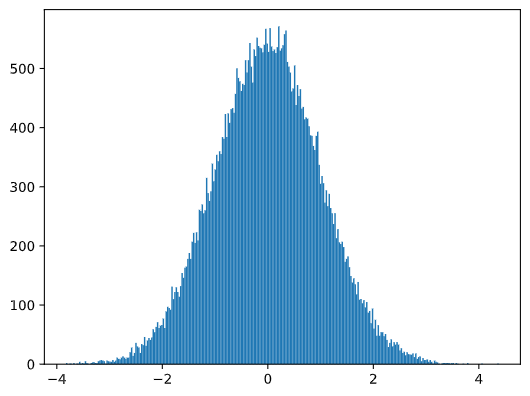

# Tổng hợp Kiến thức về Xác suất và Thống kê

##  Phân phối xác suất
- Với biến ngẫu nhiên rời rạc, xác suất được mô tả bằng hàm $P(X)$ với tổng xác suất bằng 1.
- Phân phối **đều**: mỗi kết quả trong không gian mẫu có xác suất bằng nhau.
- Đối với biến ngẫu nhiên liên tục, xác suất được mô tả bằng hàm mật độ xác suất $p(x)$ với công thức:

$$
P(t_1 \leq X < t_2) = \int_{t_1}^{t_2} p(x) \, dx
$$


## Trung bình, Phương sai và Độ lệch chuẩn(Mean, Variance and Standard Deviation)
- **Trung bình (Kỳ vọng)** $ E(X)$ của dãy mẫu:

$$
E(X) = \sum_{i=1}^{N} x_i p_i
$$

- **Phương sai** $\sigma^2$ và **Độ lệch chuẩn** $\sigma$:


$$
\sigma^2 = \frac{\sum (x_i - \mu)^2}{n}
$$

## Mode, Trung vị và Tứ phân vị (Mode, Median and Quartiles)
- **Trung vị**: Giá trị tại đó một nửa dữ liệu nhỏ hơn và một nửa lớn hơn.
- **Tứ phân**: 
  - **Q1**: 25% dữ liệu dưới giá trị này.
  - **Q3**: 75% dữ liệu dưới giá trị này.
- **Khoảng tứ phân (IQR)**: \( IQR = Q3 - Q1 \) dùng để xác định ngoại lệ.


## Phân phối chuẩn (Normal distribution)

Phân phối chuẩn (hay còn gọi là phân phối Gauss) là một loại phân phối xác suất rất quan trọng trong thống kê. Nó mô tả cách mà các giá trị dữ liệu phân bố xung quanh giá trị trung bình. Một đặc điểm chính của phân phối chuẩn là nó có hình dạng đối xứng với một đỉnh tại giá trị trung bình.

## Định Nghĩa

Một biến ngẫu nhiên \( X \) được nói là phân phối chuẩn với trung bình $\mu$ và độ lệch chuẩn $\sigma$ nếu hàm mật độ xác suất của nó được định nghĩa như sau:

$$
f(x) = \frac{1}{\sigma \sqrt{2\pi}} e^{-\frac{(x - \mu)^2}{2\sigma^2}}
$$

Trong đó:
- $ \mu$ là giá trị trung bình của phân phối.
- $\sigma$ là độ lệch chuẩn của phân phối.
- e là cơ số tự nhiên (khoảng 2.71828).

## Tính Chất

1. **Hình Dạng Đối Xứng**: Phân phối chuẩn có hình dạng chuông, với phần lớn dữ liệu nằm gần giá trị trung bình.
2. **Quy Tắc 68-95-99.7**: Khoảng 68% dữ liệu nằm trong khoảng một độ lệch chuẩn 
$( \mu - \sigma, \mu + \sigma)$, khoảng 95% nằm trong khoảng hai độ lệch chuẩn $( \mu - 2\sigma, \mu + 2\sigma)$, và khoảng 99.7% nằm trong khoảng ba độ lệch chuẩn $( \mu - 3\sigma, \mu + 3\sigma)$.
3. **Chuẩn Hóa**: Nếu một biến ngẫu nhiên \( Z \) được chuẩn hóa từ \( X \) theo công thức:
   $$
   Z = \frac{X - \mu}{\sigma}
   $$
   thì \( Z \) sẽ có phân phối chuẩn với trung bình 0 và độ lệch chuẩn 1 (được gọi là phân phối chuẩn tĩnh).

4. **Ứng Dụng**

Phân phối chuẩn được sử dụng rộng rãi trong nhiều lĩnh vực như khoa học, kinh tế, và kỹ thuật, đặc biệt là trong việc ước lượng các thông số quần thể và kiểm định giả thuyết.

5. **câu lệnh** 

```python
samples = np.random.normal(mean,std,1000)
```


## Khoảng tin cậy

# Các Công Thức Quan Trọng

## 1. Định Nghĩa Khoảng Tin Cậy

Khoảng tin cậy với độ tin cậy \( p \) được định nghĩa bởi:

$$
P(L_p \leq \mu \leq R_p) = p
$$

## 2. Công Thức Tính Khoảng Tin Cậy

Để ước tính giá trị trung bình $\mu$ của quần thể với độ tin cậy p , khoảng cho $\mu$ được tính bằng:

$$
\bar{X} \pm A \cdot \frac{D}{\sqrt{n}}
$$

Trong đó:
- $\bar{X}$: Giá trị trung bình mẫu.
- D Độ lệch chuẩn.
- n : Kích thước mẫu.
- A: Giá trị từ phân phối Student dựa trên độ tin cậy \( p \).

## 3. Tính Toán \( A \)

Giá trị \( A \) được lấy từ bảng phân phối Student \( t \):

$$
A = t_{\frac{(1 - p)}{2}, \, df}
$$

Trong đó:
- $df$: Bậc tự do, được tính bằng $ n - 1 $ (với $ n $ là kích thước mẫu).


# Tính Khoảng Tin Cậy Bằng Python

```python
import scipy.stats as stats

confidence_level = 0.95
alpha = 1 - confidence_level
t_critical = stats.t.ppf(1 - alpha/2, df=n-1)  # Giá trị t

# Khoảng tin cậy
margin_of_error = t_critical * (std_dev / np.sqrt(n))
lower_bound = mean - margin_of_error
upper_bound = mean + margin_of_error

```
## Kiểm tra giả thuyết

Giả thuyết có thể được phát biểu như sau:(ví dụ lấy từ khóa học)

- **Giả thuyết null (H0)**: Chiều cao trung bình của cầu thủ first basemen không cao hơn cầu thủ second basemen.
- **Giả thuyết thay thế (H1)**: Chiều cao trung bình của cầu thủ first basemen cao hơn cầu thủ second basemen.

### Tính Toán Khoảng Tin Cậy

Khoảng tin cậy cho chiều cao của cầu thủ first basemen và second basemen có thể được tính toán như sau:

- **Khoảng tin cậy**:
  
$$
CI_{1} = \bar{X}_{1} \pm t_{\alpha/2} \cdot \frac{S_{1}}{\sqrt{n_{1}}}
$$

$$
CI_{2} = \bar{X}_{2} \pm t_{\alpha/2} \cdot \frac{S_{2}}{\sqrt{n_{2}}}
$$

- Trong đó:
  - $\bar{X}$ là giá trị trung bình.
  - $t_{\alpha/2}$ là giá trị t từ phân phối Student.
  - $S$ là độ lệch chuẩn của mẫu.
  - $n$ là kích thước mẫu.

### Kiểm Định T của Student

Khi sử dụng kiểm định t của Student, công thức tính giá trị t được định nghĩa như sau:

$$
t = \frac{\bar{X}_{1} - \bar{X}_{2}}{s_{p} \sqrt{\frac{1}{n_{1}} + \frac{1}{n_{2}}}}
$$

- Trong đó:
  - $s_{p}$ là độ lệch chuẩn tổng hợp của hai mẫu.

### Câu Lệnh Python

Để thực hiện kiểm định t trong Python, chúng ta có thể sử dụng thư viện `SciPy`. Dưới đây là một ví dụ mã:

```python
from scipy.stats import ttest_ind

tval, pval = ttest_ind(s1, 
                       s2, 
                       equal_var=False)

```

Nếu giá trị p rất thấp, nghĩa là có bằng chứng mạnh mẽ chứng minh rằng cầu thủ chơi ở vị trí first basemen cao hơn.


## Định lý Giới hạn Trung tâm (Central Limit Theorem - CLT)
- Nếu có mẫu lớn $\N$ giá trị độc lập X_1, ..., X_N từ phân phối với trung bình $\mu$ và phương sai $\sigma^2$:
  - Khi $\N$ đủ lớn $(N \to \infty)$:
    - Trung bình mẫu $\bar{X}$ sẽ có phân phối chuẩn với:
      - Trung bình: $\mu$
      - Phương sai: $\frac{\sigma^2}{N}$

## Luật Số Lớn (Law of Large Numbers)
- Khi $N \to \infty$, xác suất rằng trung bình mẫu $\bar{X}$ bằng giá trị trung bình $\mu$ sẽ trở thành 1.

## Hiệp phương sai (Covariance) và Tương quan (Correlation)
- **Hiệp phương sai**:
  - Công thức: 
  $$
  \text{Cov}(X, Y) = E[(X - E(X))(Y - E(Y))]
  $$
- **Tương quan**:
  - Công thức:
  $$
  r = \frac{\text{Cov}(X, Y)}{\sigma_X \sigma_Y}
  $$
  - Tương quan nằm trong khoảng \([-1, 1]\):
    - $ 1$: Tương quan dương mạnh
    - $-1$: Tương quan âm mạnh
    - $ 0$: Không có tương quan

### Ví dụ Tính Tương Quan
```python
import numpy as np

# Giả sử weights và heights là các mảng chứa cân nặng và chiều cao
correlation_matrix = np.corrcoef(weights, heights)
print(correlation_matrix)