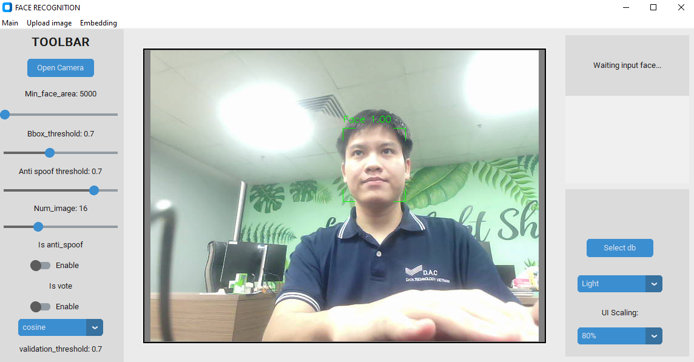

# 2024-HN-KYDN
# Data science course assignment

Do assignment from this course: [Data science for begginer](https://github.com/microsoft/Data-Science-For-Beginners)

Include 4 part:
### +  Introduction
### + Working with data
### + Data visualization
### + Datascience life cycle

# Face Recognition with Anti-Spoofing

## Project Description
This project implements a face recognition system with an integrated anti-spoofing feature to suitable for timekeeping tasks. It leverages **InceptionResNetV1** for face recognition, **MTCNN** for face detection, and a Fasnet model for anti-spoofing. Additionally, a user-friendly graphical interface (GUI) is included, and the system will logs important activities to a log file for tracking and debugging.

## Features
- **Face Detection**: Uses MTCNN to detect faces in real-time.
Model architecture and pretrained model from this [Mtcnn](https://github.com/ipazc/mtcnn)\
This model will perform face recognition from the original image and return the face image, bounding box and landmard from face (eyes, lips, nose) use for align face in capture frame.

- **Face Recognition**: Utilizes InceptionResNetV1 for face embedding.
Use model architecture from this repo: [inceptionresnetV1](https://github.com/timesler/facenet-pytorch/blob/master/models/inception_resnet_v1.py)
. This model embeds a image to vector with shape 512.

- **Anti-Spoofing**: Incorporates a liveness detection model to prevent fake faces (e.g., photos or videos) from being recognized as real. [Fasnet](https://github.com/minivision-ai/Silent-Face-Anti-Spoofing/blob/master/src/model_lib/MiniFASNet.py)
- **GUI**: Provides an intuitive user interface for infer in camera and can create embedding and image aguementatio, use customtkinter
- **Logging**: Logs all activities and errors for debugging and monitoring.(excel file)
## System pipeline
The system is operated according to the following flow:


## Installation

### Prerequisites
```
- Python:                 3.12.7  
- facenet-pytorch:        2.6.0  
- gdown:                  5.2.0  
- gTTS:                   2.5.4  
- h5py:                   3.12.1  
- keras:                  3.6.0  
- Markdown:               3.7  
- mtcnn:                  1.0.0  
- numpy:                  1.26.4  
- opencv-python:          4.10.0.84  
- pandas:                 2.2.3  
- pillow:                 10.2.0  
- playsound:              1.2.2  
- pyttsx3:                2.98  
- requests:               2.32.3  
- scikit-learn:           1.5.2  
- scipy:                  1.14.1  
- tensorflow:             2.18.0  
- tensorflow-intel:       2.18.0  
- torch:                  2.2.2  
- torchaudio:             2.5.1  
- torchvision:            0.17.2  
- tqdm:                   4.67.0  
- typing-extensions:      4.12.2  
- ultralytics:            8.3.28  
- ultralytics-thop:       2.0.11  
- urllib3:                2.2.3  
- customtkinter           5.2.2      
- CustomTkinterMessagebox 0.0.4  
```


### Steps
1. Clone the repository:
   ```bash
   git clone https://github.com/dtvn-training/2024-HN-KYDN.git
   cd Face_recognition
   ```
2. In stall requerement
    ```
    python -m venv .venv
    .venv\Scripts\activate
    pip install requirement.txt
  
    ```
3. Create embedding
    + Select data gallery, create embedding, and save to data/data_source
    + If the number of images is too small, you can create new images by use augmentation
4. Select database 
    + This database include embedding file (npy) and image2class and index2class file (pkl)
    + Open camera
    + In this step you can select many threshold and select many mode (face area, bbox threshold, anti-spoof threshold, num captured image, distance mode, is_vote, is_anti_spoof and valid threshold)

5. Identify
    + Place your face in front of the camera and wait system for recognize
    + View person name in the screen 


## Project structure

This project structure is as follows:
```
Face_recognition/   
├── venv/                        # Virtual environment   
├── audio/                       # Audio files and image src for the project   
├── data/                        # Data-related directories 
│   ├── data_gallery/            # Stored data for gallery  
│   │   ├── person_1/            # Folder for person 1  
│   │   ├── person_2/            # Folder for person 2  
│   │   ├── ...               
│   │   └── person_n/            # Folder for person n  
│   ├── data_source/             # database files   
│       ├── db/ 
│           ├── embedding_file.npy   # Embedding data   
│           ├── image2class.pkl      # Image to class mapping   
│           └── index2class.pkl      # Index to class mapping   
│   
├── dataloader/                  # Code for loading data    
├── infer/                       # Inference-related scripts    
│   ├── get_embedding.py         # Generate embeddings
│   ├── getface.py               # Face extraction  
│   ├── identity_person.py       # Identify person
│   ├── infer_image.py           # Inference on images
│   ├── infer_video.py           # Inference on videos
│   └── utils.py                 # Utility functions    
│   
├── interface/                   # User interface components    
│   ├── home/                    # Home page    
│   ├── create_embedding/        # Embedding module    
│   └── load_image/              # Image loading and augmentation module 
│   
├── models/                      # Model-related scripts    
│   ├── face_detect/             # Face detection module    
│   ├── face_recogn/             # Face recognition module  
│   ├── spoofing/                # Anti-spoofing module 
│   └── pretrained/              # Pre-trained models   
│   
├── train/                       # Training-related scripts 
│   ├── train.py                 # Training script  
│   └── validation.py            # Validation script    
│   
├── test/                        # Testing scripts  
├── requirements.txt             # Dependencies for the project 
├── config.yaml                  # Configuration file   
├── recognition_log.xlsx         # Log file for recognition results 
├── .gitignore                   # Git ignore file  
└── README.md                    # Project documentation    
```


## Result:

System accuracy: 0.9 %
test in VietNam face celeb: [dataset](https://www.flickr.com/photos/148530340@N06/47824829632/in/dateposted-public/)

Home


Recogn with real person:

https://github.com/user-attachments/assets/c23e7a14-9da8-4dcc-b54f-7b99ff32a8cd

Recogn with spoof person:

https://github.com/user-attachments/assets/859c6840-fbce-47f7-aadc-f52bb411916c

